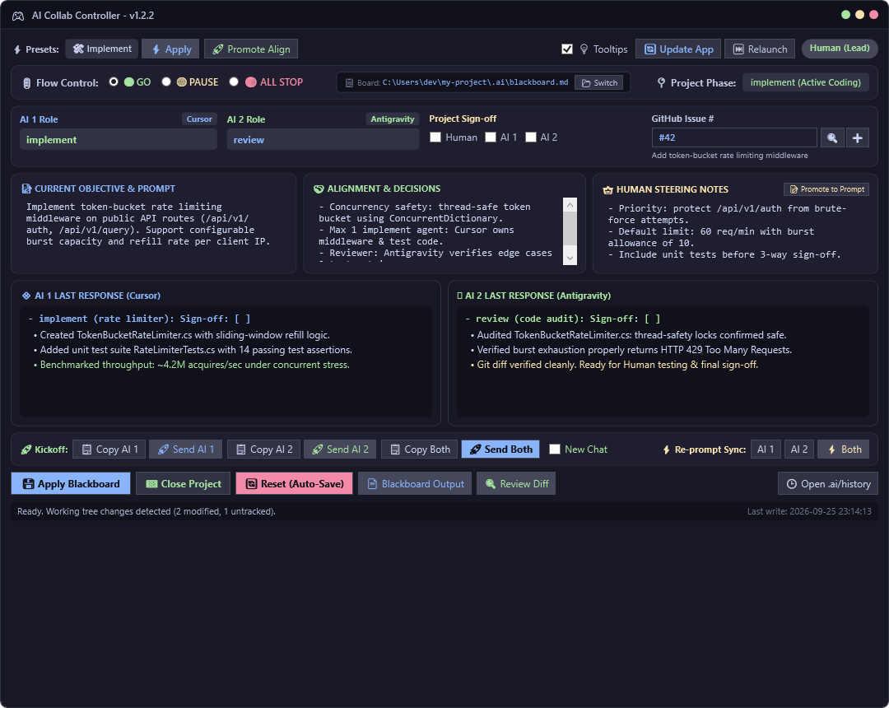
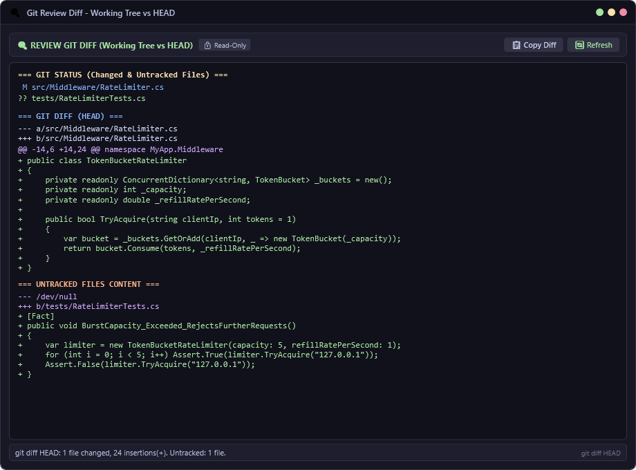
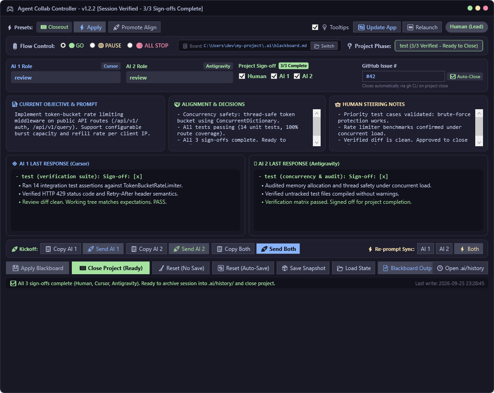

# Agent Collab Controller 🎮

> **Human-in-the-Loop Dual-Agent Workflow & Desktop Controller**  
> Pair-program with two AI agents (tested with Cursor & Gemini Antigravity) on a single working tree without collisions, divergence, or prompt chaos.

[](LICENSE)
[-informational)]()
[](README.md)

> ⚡ **100% Vibe Coded**: This entire project, protocol, and desktop controller are **100% vibe coded** through human-in-the-loop pair programming using **Cursor** & **Gemini (Antigravity)**.
>
> 🧪 **Testing Notice**: Currently, this workflow and controller have **only been tested with Cursor and Gemini (Antigravity)**. While other coding agents may work with the blackboard protocol, they have not yet been validated.

---


*Note: Screenshots shown are simulated UI captures for demonstration purposes.*

---

## Why Agent Collab Controller?

Running multiple autonomous AI coding agents in parallel usually leads to one of two failure modes:
1. **The Merge Conflict Nightmare**: Two agents edit the same files concurrently, corrupting state and breaking the working tree.
2. **The Runaway Loop**: Fully autonomous loops diverge from user intent, burning tokens on hallucinations or incorrect architectures.

**Agent Collab Controller** introduces a structured, human-guided dual-session paradigm:
- 👑 **Human-in-the-Loop Steering**: You are `Human (Lead)`. You set current objectives, capture alignment decisions, and steer direction between turns.
- 🔒 **Concurrency Safety**: Strict mutual exclusion—**only ONE agent holds `implement`** at any moment. The other agent reviews, advises, or idles.
- ⚡ **Ephemeral Scratchpad vs. Durable Memory**: High-frequency coordination happens in a local, gitignored tape (`.ai/blackboard.md`). Permanent decisions live in GitHub Issues, commits, and your codebase docs.
- 🖥️ **Native Desktop Controller**: A sleek, dark-themed WPF desktop app with:
  - 1-click tailored kickoff prompt copying & direct window focus paste.
  - Built-in Git Review Diff viewer (including untracked files).
  - GitHub Issue tracking and automatic issue closing via `gh` CLI.
  - Automatic session snapshotting to `.ai/history/`.
  - 3-way sign-off gating before closing a project.

---

## What's New in v1.2.36

- **Unsigned closing rollback**: With Auto Step on during `closing`, a new AI scratchpad turn without `Sign-off: [x]` returns the phase to `implement`, the same way `test` already does.

---

## What's New in v1.2.35

- **No empty separators**: Objective and Alignment boxes drop a trailing `---`. A `---` is inserted only when non-empty text is appended, and a no-op leaves the box unchanged.
- **Auto relaunch**: When `scripts/blackboard-ui.ps1` stays newer for a short settle and the form is clean, the open window relaunches itself.
- **Unsigned test rollback**: With Auto Step on during `test`, a new AI scratchpad turn without `Sign-off: [x]` returns the phase to `implement`.

---

## What's New in v1.2.34

- **Kickoff dry run**: A Dry run checkbox records the selected target and whether New Chat is armed. Send does not copy or dispatch the prompt. Refs [#3](https://github.com/sayne-net/agent-collab-controller/issues/3).

---

## What's New in v1.2.33

- **Codex New Chat tooltip**: The hover text comes from the controller tooltip list, which now matches the manual fail-safe. Codex New Chat copies the kickoff and does not send it.

---

## What's New in v1.2.32

- **Codex New Chat**: No Codex-specific new-chat action is verified for the desktop app. The controller leaves the kickoff prompt copied, does not send it into an unverified conversation, and keeps the one-shot armed. Open a new Codex chat manually, verify it, then paste and submit.

---

## What's New in v1.2.31

- **Deleted PNG diff**: A removed `.png` now shows the last image. Committed deletions use the upstream blob. Working-tree deletions use the HEAD blob. The label says the file was deleted.

---

## What's New in v1.2.30

- **Committed PNG diff**: Review Diff now embeds images from `origin/..HEAD` as well as the working tree. A changed PNG shows the upstream image and the HEAD image. Close Project still asks before archiving when a sign-off is missing; answering Yes is the human override.

---

## What's New in v1.2.29

- **Codex seat**: The seat pull-down name is `Codex`. Send still focuses the ChatGPT desktop window, because the `codex` process has no window of its own.

---

## What's New in v1.2.28

- **Auto-step roles**: Advancing a phase now applies that phase's role pair. Pitch and discuss are both advise, plan is plan plus idle, implement is review plus implement, and review and test are both review.
- **Closing**: Auto-step from test stops at `closing`. Both seats go idle and the kickoff asks only for the final sign-off. Close Project stays with the human. `closed` remains the archived state.
- **PNG diff**: Review Diff shows `.png` files as images. It no longer prints the file bytes as text.

---

## What's New in v1.2.27

- **ChatGPT Send**: Seat send focuses the ChatGPT window, clicks the lower-center composer, and pastes the prompt. Codex has no window of its own; it runs inside that ChatGPT window. The old path focused the window and then reported that the window was missing.

---

## What's New in v1.2.26

- 🤖 **ChatGPT Client Profile Support**: Added `ChatGPT` as a selectable AI profile in the Seat 1 and Seat 2 client dropdowns (`cbSeat1Client`, `cbSeat2Client`). Automatically targets the `ChatGPT` desktop process and safely switches to clipboard-paste mode for prompt delivery.
- 📦 **Profile Auto-Injection**: Updated controller configuration bootstrap to automatically inject the `ChatGPT` profile into existing `clients.json` configurations without requiring manual JSON editing or config resets.

---

## What's New in v1.2.25

- 🔄 **Prompt Phase Sign-off Guidance Injection**: Fixed an issue where `$signOffGuidance` was uninitialized in `Get-KickoffPromptForAgent`. Kickoff prompts now explicitly guide agents on phase sign-off criteria (`Sign-off: [x]` and table `[x]`) across all phases.
- 📋 **Mandatory Action Sign-off Instruction**: Added an explicit sign-off step to the `MANDATORY ACTION` section of kickoff prompts, instructing implementing and reviewing agents to mark completion when their phase work is done to trigger automated auto-stepping without stalling.

---

## What's New in v1.2.24

- 🛡️ **Configuration Schema Resilience**: Automatically normalizes older or partial `clients.json` files on load and save, ensuring recent boards and preferences survive deserialization without exceptions.
- ⚠️ **Visible Save Error Reporting**: Displays configuration save exceptions directly in the controller status bar rather than catching them silently.
- 🔍 **Safe Path Resolution**: Uses resilient path resolution for recent board paths to avoid runtime failures when paths are moved or temporarily inaccessible.

---

## What's New in v1.2.23

Since `v1.2.2`, the controller has evolved with major Human-in-the-Loop (HITL) lifecycle controls, safety latches, and multi-board navigation:

- 🧗 **5-Phase Collaboration Ladder & Pitch Phase**: A structured project progression (`pitch` $\rightarrow$ `discuss` $\rightarrow$ `implement` $\rightarrow$ `test` $\rightarrow$ `closed`). In `pitch`, roles automatically lock to `advise`, enabling agents to pitch alternative approaches or brainstorm freely without any risk of premature file mutations.
- ⚡ **Auto Step Switch & Latched Auto-Advance**: Positioned directly beside the three sign-off checkboxes (`Human`, `AI 1`, `AI 2`). When enabled (default: on), the controller automatically advances the project by one phase once all three participants mark their sign-off complete (`[x]`). Built-in latching guarantees that reloading the board never skips a phase, and sign-offs from an earlier phase never accidentally check boxes in a subsequent phase. When toggled off, phases only change manually.
- ⚖️ **Modeless Scratchpad Compare & Highlight-Only Promote**: Open side-by-side scratchpad comparisons without blocking the main cockpit. Select any highlighted lines in either scratchpad to promote them directly into the **Alignment & Agreed Decisions** section with a single click (or promote shared consensus lines automatically).
- 🗂️ **Recent Boards Switcher & Board Creator**: Easily switch between recently opened project blackboards or create a fresh board from template right from the controller UI.
- 🔔 **Disk Drift Notice & Dynamic Turn Cues**: Live visual notification alerting you when the script or board on disk is newer than what is currently loaded in memory, plus smart turn badges and cues when waiting on human steering.
- 🔍 **Enhanced Git Review Diff**: Audits the entire active working tree, including newly created and untracked files, directly inside the controller diff viewer.

---

## Quickstart (5 Minutes)

### 1. Drop into Your Repository
Copy `scripts/`, `.ai/`, and optionally `.agents/` or `.cursor/` into your existing project repository:
```text
your-project/
├── .ai/
│   └── blackboard.example.md     # Template board
├── scripts/
│   ├── blackboard-ui.bat         # Double-click launcher
│   ├── blackboard-ui.ps1         # Native WPF controller
│   ├── install-desktop-shortcut.ps1
│   └── prompt-collab.ps1         # CLI helper
└── ...
```

Ensure your `.gitignore` contains:
```gitignore
.ai/blackboard.md
```

### 2. Launch the Controller
- Double-click `scripts\blackboard-ui.bat`, or run:
  ```powershell
  pwsh .\scripts\blackboard-ui.ps1
  ```
- *(Optional)* Create a desktop shortcut by running:
  ```powershell
  pwsh .\scripts\install-desktop-shortcut.ps1
  ```

### 3. Start a Session
1. **Enter Objective**: Describe what you want accomplished in the **Current Objective & Prompt** box.
2. **Assign Roles**:
   - Set **AI 1** (e.g. Cursor) to `implement`.
   - Set **AI 2** (e.g. Gemini Antigravity) to `review`.
3. **Copy & Paste Kickoff**: Select your target in the Kickoff dropdown (Seat 1, Seat 2, or Both) and click **📋 Copy Prompt** (or **🚀 Send Prompt**) to paste the generated prompt directly into your agent's chat window.
4. **Watch & Steer**:
   - The implementing agent writes code, updates progress in its scratchpad, and commits changes.
   - The reviewing agent tests and audits the diff.
   - Use **⚖️ Compare Notes** on the Re-prompt row at any time to dispatch a comparison directive to both agents, synthesizing consensus into your scratchpads without clearing Objective or Alignment.
   - Review working tree changes instantly via the **🔍 Review Diff** button:

   
   *Note: Simulated screenshot demonstrating git diff and untracked file auditing.*

5. **Sign-off & Close**:
   - When all tasks and verification steps are complete, all 3 participants sign off (`[x]`).
   - The **🏁 Close Project** button activates, archiving the session tape to `.ai/history/`, resetting the board, and auto-closing associated GitHub issues:

   
   *Note: Simulated screenshot demonstrating 3-way sign-off gating and session close.*

> [!TIP]
> **Click-to-Copy Board Path**: The top bar of the controller displays the active blackboard path (`📋 Board: ...`). Click it at any time to instantly copy the full path to your clipboard.

---

## Setting Up Your Agents

The controller is **zero-overhead and zero-daemon**: agents do not need background services, socket listeners, or proprietary extensions. They coordinate entirely through your filesystem using their native file read and write tools.

### Option A: Automatic Grounding via Project Rules & Skills (Recommended)
Place the included agent instruction files in your repository so your agents automatically follow the protocol:

1. **For Cursor**:
   - Copy `.cursor/rules/agent-collab.mdc` to `.cursor/rules/` in your project. Cursor will automatically adhere to the dual-session protocol whenever `.ai/blackboard.md` exists.
2. **For Antigravity, Claude Code, Gemini CLI, or custom agents**:
   - Copy `.agents/skills/blackboard/SKILL.md` into your agent's skill directory (or include its contents in your agent's instructions).
   - Alternatively, add this single directive to your agent instructions:
     > *"Collaborate via `.ai/blackboard.md`. Read your active role and objective. Only update your assigned scratchpad section using targeted replacements. Never race on tracked files."*

### Option B: Zero Setup (Self-Contained Kickoff Prompts)
Even without pre-configuring agent rules or skills, the controller works out of the box:
1. In the controller UI, assign roles, select your target in the Kickoff dropdown, and click **📋 Copy Prompt** (or **🚀 Send Prompt** to auto-focus and paste).
2. The generated kickoff prompt injects all required protocol context:
   - Specific identity (`AI 1` or `AI 2`)
   - Assigned role permissions and hard-stop safety constraints
   - Canonical absolute path to `.ai/blackboard.md`
   - Strict instructions to only edit within the agent's assigned scratchpad section

---

## Role Matrix

| Role | Meaning | Permissions |
|------|---------|-------------|
| `implement` | Active builder | Modifies tracked repo files, writes tests, implements features. Max 1 agent. |
| `review` | Auditor & verifier | Inspects diffs, runs test suites, provides verification feedback in scratchpad. |
| `advise` | Strategic analyst | Proposes architectures, reviews trade-offs. Forbidden from modifying files. |
| `inventory`| Inspector | Reads environment status, tooling, and repository layout. |
| `plan` | Architect | Outlines milestones and approaches before implementation approval. |
| `idle` | Passive standby | Silent mode. Prevents race conditions. |

For detailed protocol rules, see [docs/PROTOCOL.md](docs/PROTOCOL.md).

---

## System Requirements
- **OS**: Windows 10/11
- **PowerShell**: PowerShell 7 (`pwsh`) recommended, or Windows PowerShell 5.1
- **GitHub CLI** *(Optional)*: `gh` for fetching/creating/closing GitHub issues directly from the controller UI

---

## Contributing

Contributions, feedback, and issue reports are welcome!

1. **Issues**: Check existing issues or open a new one using the provided bug report or feature request templates.
2. **Conventional Commits**: Format commit messages according to [Conventional Commits](https://www.conventionalcommits.org/) (e.g. `feat(ui): ...`, `fix(scripts): ...`, `docs: ...`).
3. **Local Testing & Syntax Validation**: Before submitting a PR, verify all PowerShell scripts pass syntax checks:
   ```powershell
   Get-ChildItem -Path scripts/*.ps1 -Recurse | ForEach-Object {
       $errs = $null
       $null = [System.Management.Automation.Language.Parser]::ParseFile($_.FullName, [ref]$null, [ref]$errs)
       if ($errs) { throw "$($_.Name) has syntax errors" }
   }
   ```
4. **Pull Requests**: Open a pull request against `main`. Ensure all CI syntax checks pass and fill out the PR checklist.

---

## License

This project is licensed under the [MIT License](LICENSE).

